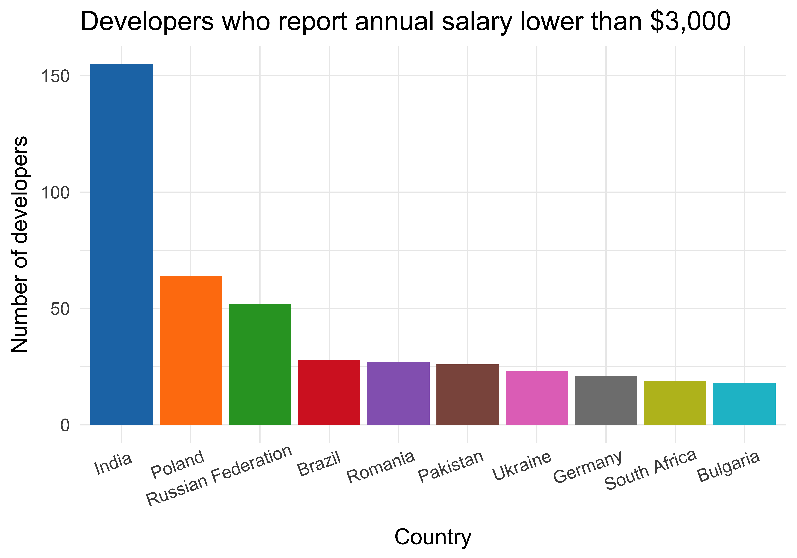
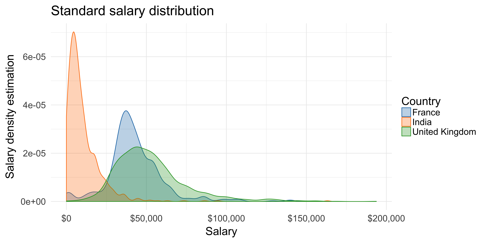
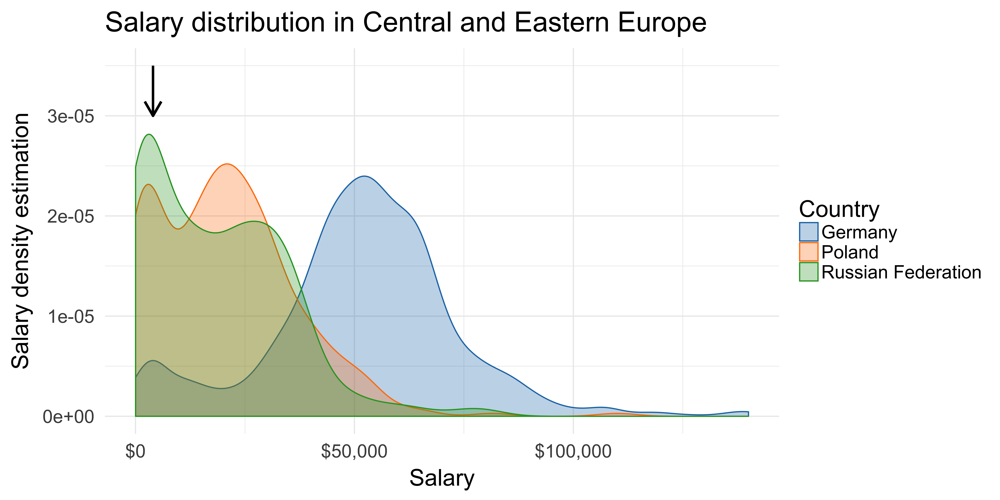
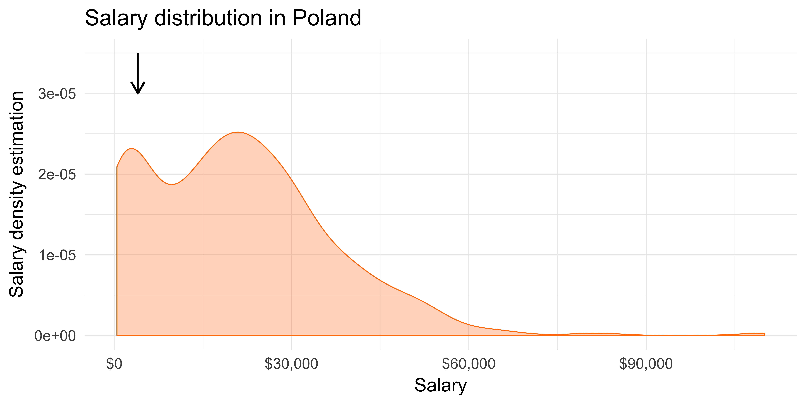
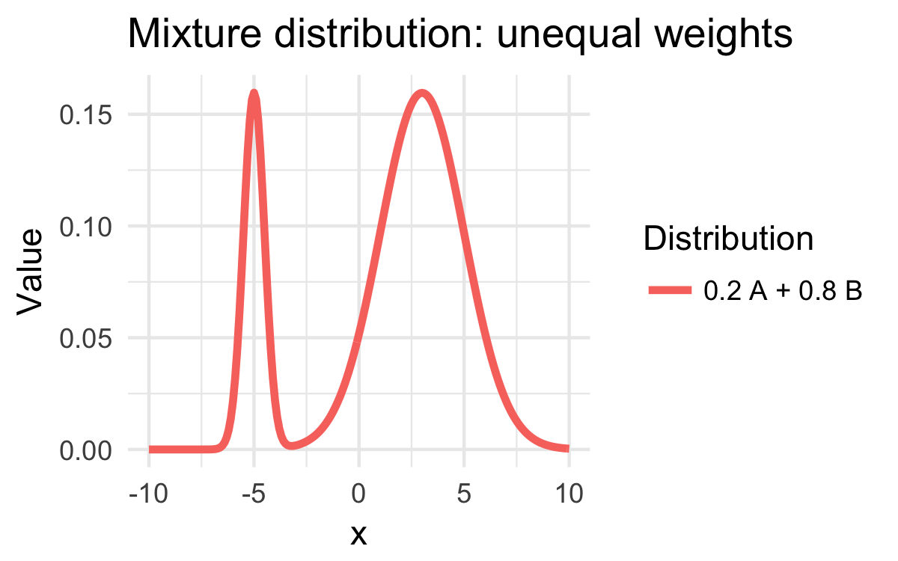
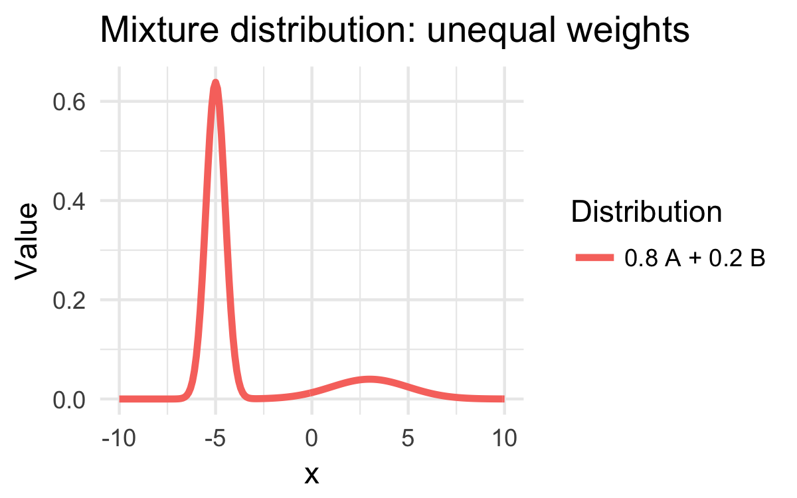

- title : Probabilistic Programming
- description : Probabilistic programming: how to look like a statistician
- author : Evelina Gabasova
- theme : white
- transition : none

***

## How to look like a statistician
### A developer's guide to probabilistic programming

 
### Evelina Gabasova
### @evelgab

------------------------------------------------------------------------------------------------

------------------------------------------------------------------------------------------------

------------------------------------------------------------------------------------------------

- data-background: images/stock-photo-mathematician.jpg

------------------------------------------------------------------------------------------------

# Probabilistic programming

' what is probabilistic programming
' It's about writing probability distributions and their manipulations first-class citizens in 
' a programming language
' But why would you use that?

------------------------------------------------------------------------------------------------

# Probabilistic models

' what are they actually?

------------------------------------------------------------------------------------------------

- data-background: images/developer-survey-2017.png

------------------------------------------------------------------------------------------------

### Salary distribution

------------------------------------------------------------------------------------------------

------------------------------------------------------------------------------------------------

------------------------------------------------------------------------------------------------

------------------------------------------------------------------------------------------------

# What's wrong?

------------------------------------------------------------------------------------------------

> What is your current <u>annual</u> salary, in [local currency]? Please enter a whole number in the box below, without any punctuation. If you prefer not to answer, please leave the box empty/blank.

------------------------------------------------------------------------------------------------

------------------------------------------------------------------------------------------------

# Theory
## People reported their monthly salary

------------------------------------------------------------------------------------------------

## Mixture distributions

------------------------------------------------------------------------------------------------

------------------------------------------------------------------------------------------------

------------------------------------------------------------------------------------------------

------------------------------------------------------------------------------------------------

------------------------------------------------------------------------------------------------

- data-background : images/bored.gif

------------------------------------------------------------------------------------------------

# Probability distributions
## in probabilistic programming

' are an integral part of any probabilistic programming language and you can manipulate them

------------------------------------------------------------------------------------------------

' what does it mean?

## Mixture distribution: formally

$$$
\text{Salary} = p \; \mathcal{N}\left(\mu, \sigma^2\right) + \left(1-p\right) \; \frac{1}{12} \; \mathcal{N}\left(\mu, \sigma^2\right)

 

unknown: $ \mu$, $\sigma^2$, $p$

------------------------------------------------------------------------------------------------

# ?

------------------------------------------------------------------------------------------------

# Sampling

' is a very efficient way of inferring 

------------------------------------------------------------------------------------------------

# Sampling: example
## Monty Hall problem

------------------------------------------------------------------------------------------------

# Monty Hall problem

------------------------------------------------------------------------------------------------

------------------------------------------------------------------------------------------------

------------------------------------------------------------------------------------------------

------------------------------------------------------------------------------------------------

------------------------------------------------------------------------------------------------

------------------------------------------------------------------------------------------------

------------------------------------------------------------------------------------------------

------------------------------------------------------------------------------------------------

## Demo
### Monte Carlo sampling

------------------------------------------------------------------------------------------------

# Sampling 
## for mixture distributions

Easy if we knew the values of the unknown parameters

------------------------------------------------------------------------------------------------

## Mixture distributions: sampling

	let salary = Gaussian(mean,variance)
	let mistake = Bernoulli(probability)

	let observed =
	    if mistake then
	        1/12 * salary
	    else
	        salary

' much simpler
' This is an example of a potential probabilistic programming language
' Manipulating probability distributions directly

------------------------------------------------------------------------------------------------

## Demo
### Modelling probability distributions with computation expressions

------------------------------------------------------------------------------------------------

# Sampling 
## for mixture distributions

But how do we get the parameters?

------------------------------------------------------------------------------------------------

------------------------------------------------------------------------------------------------

' You get PhD from Cambridge for this stuff
' This is exactly why people use probabilistic programming - because you don't have to know how 
' it works underneath

------------------------------------------------------------------------------------------------

## The world's slowest probability inference engine

------------------------------------------------------------------------------------------------

- data-background : images/mixture-of-gaussians-parameters.png
- class : withbackground

<h1> complete enumeration </h1>

------------------------------------------------------------------------------------------------

------------------------------------------------------------------------------------------------

## Demo
### The world's slowest probabilistic language

------------------------------------------------------------------------------------------------

------------------------------------------------------------------------------------------------

# Probabilistic programming
## in the real world

------------------------------------------------------------------------------------------------

- data-background : images/mixture-of-gaussians-parameters.png
- class : withbackground

<table>
<tr>
  <td class="noborder" style="width:60%;"></td>
   <td class="noborder" style="width:40%;">

<h1> Evelina Gabasova </h1>
<h1 >
@evelgab </h1>
<h1>evelinag.com</h1> 
      
</td> 
</tr>
</table>
